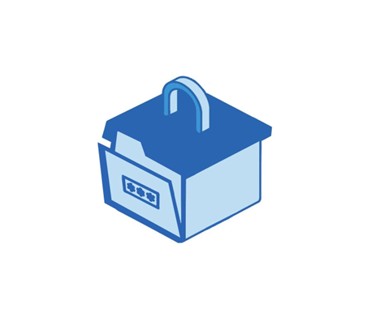

#### 2023-GP1-16
# Secure Box

# Overview
Nowadays, mobile phones have become an essential part of our lives in the current age of technology, acting as our personal assistants, entertainment centres of activity, and communication engines. 
The limited storage of smartphones frequently causes a problem for users who gather multimedia files and application data. Furthermore, the constant presence of security risks linked to file storage on mobile devices, such as the potential for hacking or damage, intensifies the necessity for a dependable and robust solution.
We propose a file storage and sharing system that makes use of server-based storage and encryption to mitigate these concerns. 
Our solution seeks to reduce the risk of data loss or unauthorized access while providing users with an effortless and secure platform for storing and accessing their files.
Therefore, our project intends to provide customers with a secure, practical, and effective file-storing and sharing experience by merging these advanced technologies. To meet the evolving needs of mobile users in a world that is becoming more connected, we set a high priority on data security, encryption, and user-friendly functionality.
# Technology

# launching Instructions

